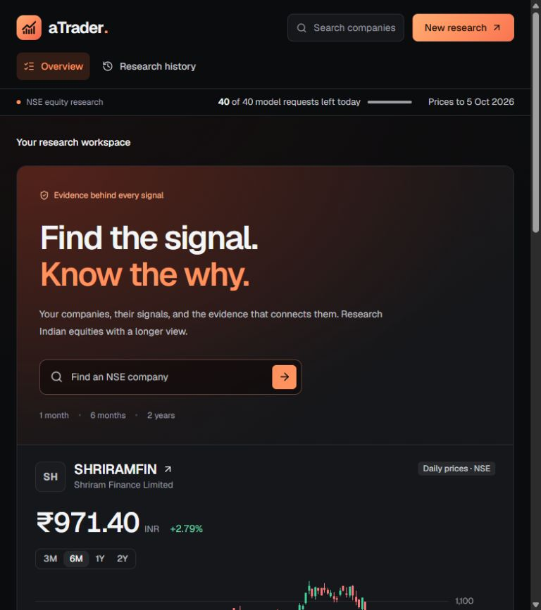
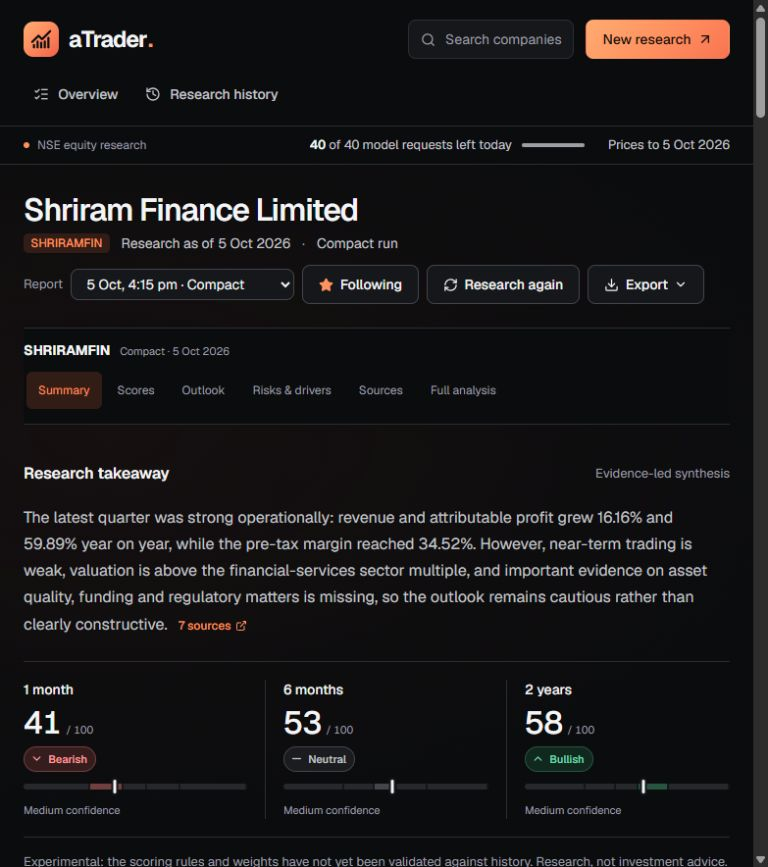
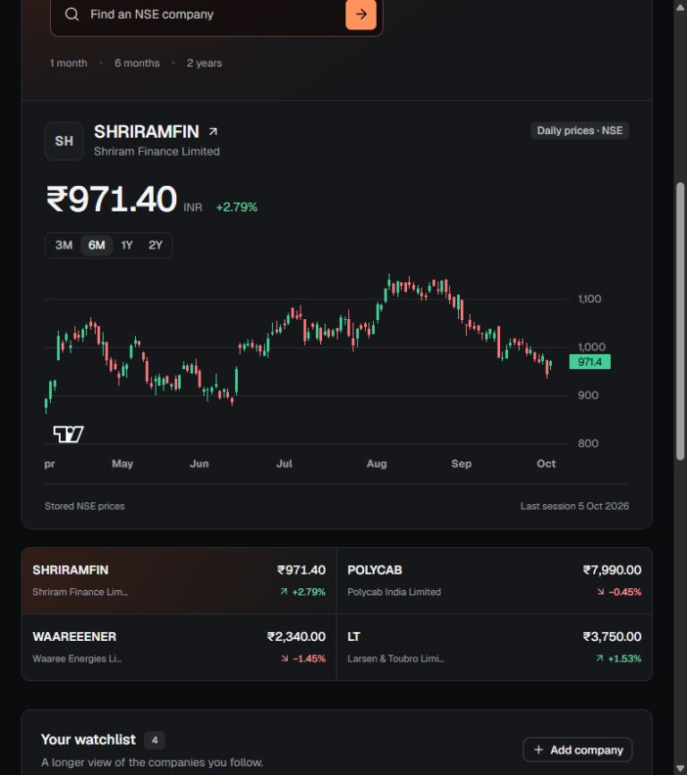
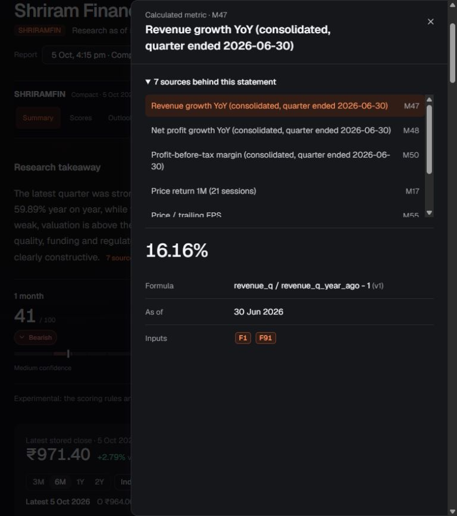
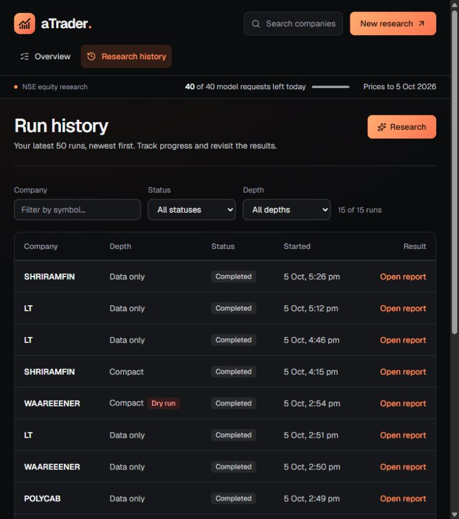
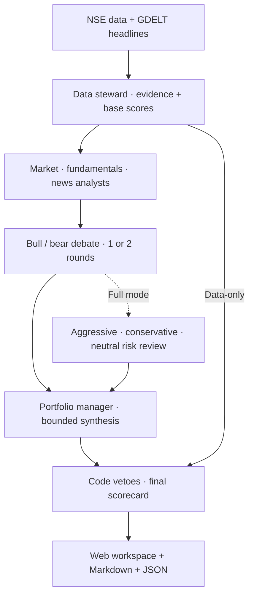

<div align="center">
  
  <h1>aTrader</h1>
  <p><strong>Find the signal. Know the why.</strong></p>
  <p>Evidence-linked research for Indian equities.<br>Three time horizons. Traceable scores. A local workspace.</p>
  <p><sub>Python 3.12+ · LangGraph · FastAPI · Next.js · SQLite · OpenRouter</sub></p>
  <p>
    <a href="#workspace">Workspace</a> ·
    <a href="#quick-start">Quick start</a> ·
    <a href="#research-modes">Research modes</a> ·
    <a href="#how-it-works">How it works</a> ·
    <a href="#development">Development</a> ·
    <a href="#documentation">Documentation</a>
  </p>
</div>

---

aTrader turns official NSE data into a research report for one company at a time. Python computes the indicators, scores, price levels, and scenarios; a team of agents explains the evidence, debates the outlook, and makes bounded, verified adjustments. The result is a **0–100 score and signal for 1 month, 6 months, and 2 years**, with the reasoning available beside the numbers.

Use the web workspace to follow companies, read reports, inspect citations, and manage research runs—or run the same engine from the command line.

> **Working first version · Experimental scoring.** The rules and weights have not yet been validated against historical outcomes. This is personal research, not investment advice. aTrader places no orders.



*Captured from the running frontend using saved research and NSE prices through 5 October 2026. Screenshots show archived results, not live quotes; dry runs retain their labels.*

## What you can do

| Capability | What it gives you |
| --- | --- |
| **Follow your companies** | Search NSE listings by name, symbol, or ISIN; keep a watchlist with last closes and the latest horizon signals. |
| **Read the whole outlook** | A research takeaway, three horizon scores, confidence, pros and cons, and the full analyst and debate output. |
| **Trace a claim** | Open a citation to inspect its value, date, formula, inputs, or original filing link. Unsupported claims are marked and excluded from later agent reasoning. |
| **Understand price context** | Daily candlesticks, moving averages, volume, support and resistance, anchored VWAPs, and the heaviest-traded band. |
| **See what changes the signal** | Code-computed hypothetical closing prices that would move a horizon into another signal band. |
| **Control the research** | Choose the depth and request budget, follow live stage progress, cancel work, or resume from a checkpoint. |
| **Keep the result** | Export a compact signal card, full Markdown analysis, or structured JSON. |

## Workspace

The charcoal-and-orange interface keeps the report, price context, and supporting evidence close together. Every signal carries both a number and a label; report dates and missing sources stay visible.

### Research report

Read the takeaway and compare the short-, medium-, and long-term signals. Continue into the area scores, chart, outlook, risks, source coverage, and full analysis.



<details>
<summary><strong>Price context — stored NSE sessions and quick company selection</strong></summary>

Switch between followed companies and chart ranges. The overview shows the latest stored close and its session date; company and report charts also offer indicators and report levels.



</details>

<details>
<summary><strong>Evidence drawer — follow the reasoning back to its inputs</strong></summary>

A statement's sources open together. Calculated metrics show the formula, source date, and underlying evidence IDs; reported facts link back to their source documents when available.



</details>

<details>
<summary><strong>Research history — find and revisit previous runs</strong></summary>

Filter runs by company, status, and research depth, then open a saved report or inspect a run. Active runs provide stage updates over server-sent events; historical runs do not invent missing progress logs.



*This archive preview uses report generation times for its history-row timestamps.*

</details>

## Quick start

You need **Python 3.12+**, **uv**, and **Node.js 20.9+ with npm** for the web app. An OpenRouter key is optional for data-only research and dry runs.

### 1. Install and configure

Run these commands from the repository root:

```powershell
uv sync
Copy-Item .env.example .env
npm --prefix apps/web ci
```

For AI-assisted research, add `OPENROUTER_API_KEY` to `.env`. Leave it unset if you want to start with data-only research. Keep `.env` private; it is ignored by Git.

On macOS or Linux, use `cp .env.example .env` for the copy step.

### 2. Download the price history

```powershell
uv run atrader ingest
```

The initial download can take **30–40 minutes** at the project's conservative request rate. It collects roughly 300 price/index sessions and about 100 delivery-position sessions; later runs fetch missing days. NSE access and connection speed affect the duration.

### 3. Open the workspace

Start the API in one terminal:

```powershell
uv run atrader serve
```

Start the frontend in a second terminal:

```powershell
npm --prefix apps/web run dev
```

Open **[localhost:3000](http://localhost:3000)**. Search for a company, add it to your watchlist, and choose **New research**. Data-only is the web form's default; AI modes show their request usage before you start.

The API's interactive documentation is at **[127.0.0.1:8000/v1/docs](http://127.0.0.1:8000/v1/docs)**.

### Prefer the command line?

```powershell
# Research without model requests or an API key
uv run atrader research LT --mode data_only

# Exercise the agent graph with real data and placeholder model output
uv run atrader research LT --dry-run

# Generate an AI-assisted report after configuring your key
uv run atrader research LT --mode compact
```

A dry run avoids model requests; it still collects real market data and may need network access. The CLI defaults to compact mode when `--mode` is omitted.

Every completed report writes three files to `reports/`:

```text
<SYMBOL>-<date>-<mode>-<run>.md           Signal card
<SYMBOL>-<date>-<mode>-<run>-details.md   Full analysis
<SYMBOL>-<date>-<mode>-<run>.json         Structured report and evidence
```

## Research modes

| Mode | Planned model calls | Hard call cap | Research path |
| --- | ---: | ---: | --- |
| `data_only` | **0** | **0** | Evidence collection and deterministic scoring; news is not scored. |
| `compact` | **6** | **8** | Three analysts, one bull/bear debate round, and the portfolio manager. |
| `full` | **11** | **14** | Three analysts, two debate rounds, three risk reviewers, and the portfolio manager. |

The cap includes retries and repairs, so the actual request count can exceed the planned count. The gateway permits only zero-priced routes: explicit `:free` models, `openrouter/free`, or reviewed zero-priced models in the allowlist. It checks the catalog at runtime and enforces the configured daily allowance locally.

When the allowance runs out, the run pauses with a checkpoint:

```powershell
uv run atrader resume RUN_ID
```

<details>
<summary><strong>Useful commands</strong></summary>

| Command | Purpose |
| --- | --- |
| `uv run atrader search "larsen"` | Find NSE symbols and ISINs. |
| `uv run atrader research SYMBOL --mode full` | Run the full research workflow. |
| `uv run atrader research LT --cutoff YYYY-MM-DD --mode data_only` | Research with a specified knowledge cutoff. |
| `uv run atrader models` | List eligible free models and check the configured choices. |
| `uv run atrader usage` | Show today's request usage; accounting uses UTC days. |
| `uv run atrader runs` | List recent runs and their status. |
| `uv run atrader serve` | Start the local web API. |

</details>

## How it works

Inspired by [TradingAgents](https://github.com/TauricResearch/TradingAgents), the graph separates deterministic calculations from model reasoning. Each agent is a small graph node with a `create_<agent>(llm)` factory.



**Collect and freeze the evidence.** The data steward builds a dated evidence pack with IDs for reported facts, calculated metrics, announcements, shareholding, and headlines. Analysts run in parallel; bull and bear researchers work in parallel within each bounded debate round. Full mode adds parallel risk reviewers.

**Verify the reasoning.** Claims must cite known evidence IDs, and numbers are checked against the pack. Unsupported claims do not reach later agents. Verification checks citations and numeric support; human semantic evaluation remains part of the roadmap.

**Compute the final result.** Code owns the scorecard, price ranges, levels, signal-flip closes, and vetoes. Verified analyst adjustments are limited to ±15 within their own eligible area; portfolio-manager adjustments are limited to ±5 per horizon. A persuasive narrative cannot override missing-data or freshness constraints.

### How to read a score

The technical, growth and quality, and valuation areas start at 50 before evidence-linked rules move them. News is scored from the news analyst's rated events. Each horizon uses a different mix:

| Area | 1 month | 6 months | 2 years |
| --- | ---: | ---: | ---: |
| Technical | 45% | 20% | 5% |
| Growth & quality | 15% | 35% | 45% |
| Valuation | 10% | 25% | 35% |
| News & catalysts | 30% | 20% | 15% |

| Score | Signal |
| --- | --- |
| 0–29 | Strong Bearish |
| 30–44 | Bearish |
| 45–55 | Neutral |
| 56–70 | Bullish |
| 71–100 | Strong Bullish |

Missing areas are excluded and the remaining weights are redistributed. **Below 60% weighted coverage, no signal is issued.** Vetoes for stale prices, short histories, old results, or low liquidity can cap signals at Neutral or below; missing core data can withhold them altogether.

Technical rule groups are capped to reduce repeated counting of the same price move. Valuation uses the stock's NSE sector index first and the Nifty 50 as fallback. `scorecard/3` removes single-quarter PEG and promoter-percentage bonuses or penalties. A positive-earnings company without a valid index P/E comparison has no valuation score. See the [scoring implementation](src/atrader/analytics/scoring.py) for the exact rules.

**Ranges describe uncertainty.** The 1- and 6-month ranges use historical volatility; 2-year ranges use bear/base/bull EPS × P/E scenarios only when eight comparable quarters support a trailing-year EPS growth comparison. They are not forecasts. A separate reverse earnings sensitivity shows the EPS growth required for an assumed 10% annual price return and sector/market exit multiple, with cited inputs and explicit assumptions. Price levels describe past trading, and signal-flip closes re-score a hypothetical next close with other inputs fixed. These are not entries, stops, or targets.

### Data sources

| Source | Current use |
| --- | --- |
| NSE equity master | Company names, symbols, series, and ISINs. |
| NSE bhavcopy and delivery files | End-of-day prices, traded volume, delivery share, and flow metrics. |
| NSE index files and industry classification | Nifty 50 and sector context, relative strength, and valuation comparisons. |
| NSE quarterly XBRL results | Revenue, profit, margins, growth, and earnings inputs. |
| NSE announcements and shareholding | Disclosures, order-win notices, and promoter/public ownership. |
| GDELT | Company-filtered headline metadata; missing or rate-limited news stays visible as a coverage gap. |

## Configuration

Backend settings live in `.env`; [.env.example](.env.example) is the starting point.

| Setting | Default | Purpose |
| --- | --- | --- |
| `OPENROUTER_API_KEY` | Unset | Required for real AI-assisted runs. |
| `ATRADER_QUICK_MODEL` | `openrouter/free` | Model used for quick-tier calls. |
| `ATRADER_DEEP_MODEL` | `openrouter/free` | Model used for deep-tier calls. |
| `ATRADER_DAILY_REQUEST_LIMIT` | `50` | Set this to your account's actual allowance. |
| `ATRADER_DAILY_REQUEST_RESERVE` | `10` | Requests held back from routine research; the default usable budget is 40. |
| `ATRADER_MAX_CONCURRENT_REQUESTS` | `4` | Maximum simultaneous model requests. |
| `ATRADER_PRICE_HISTORY_SESSIONS` | `300` | Price history retained per research run. |
| `ATRADER_DATA_DIR` | Per-user application data | Location of SQLite state, caches, and checkpoints. |

Runtime data defaults to the per-user application-data directory (`%LOCALAPPDATA%\atrader` on Windows); report exports default to the repository's `reports/` folder. Keep caches and databases outside OneDrive when possible.

The frontend connects to port 8000 on its own hostname by default. `NEXT_PUBLIC_API_URL` can override that base URL when you configure a different local setup. The API listens on loopback by default, restricts accepted hosts, and checks origins for state-changing requests.

## Development

Follow [CONTRIBUTING.md](CONTRIBUTING.md) for branch names, commit structure and review expectations.

```powershell
# Backend: offline tests and lint
uv run pytest
uv run ruff check src tests

# Frontend: TypeScript and production build
npm --prefix apps/web run typecheck
npm --prefix apps/web run build
```

Tests use synthetic data and do not require model calls. After changing the API, regenerate the schema and frontend types:

```powershell
uv run atrader openapi apps/web/openapi.json
npm --prefix apps/web run types
```

### Repository layout

```text
apps/web/                 Next.js workspace, charts, reports, evidence drawer
src/atrader/
  agents/                 Analysts, researchers, risk reviewers, manager
  analytics/              Indicators, scoring, ranges, levels, flows, vetoes
  api/                    FastAPI routes, reports, watchlist, run queue and events
  contracts/              Typed evidence, agent, run, and scoring models
  data/                   NSE/GDELT adapters, XBRL parsing, SQLite store
  graph/                  LangGraph orchestration, checkpoints, run registry
  llm/                    Free-only policy, gateway, request accounting
  report/                 Signal-card, full-analysis, and JSON exports
  verification/           Citation, numeric-support, and adjustment checks
tests/                    Offline backend tests and fixtures
docs/                     Product and technical documentation
  screenshots/            Frontend captures used in this README
reports/                  Generated research output (Git-ignored)
```

<details>
<summary><strong>Local API reference</strong></summary>

| Endpoint | Purpose |
| --- | --- |
| `GET /v1/status`, `GET /v1/usage` | Data freshness, model setup, and request budget. |
| `GET /v1/instruments?query=` | Search companies. |
| `GET /v1/instruments/{symbol}/bars` | Split-adjusted daily bars and 20/50/200-session averages. |
| `POST /v1/runs` | Queue a run; one worker executes research at a time. |
| `GET /v1/runs`, `GET /v1/runs/{id}` | Run history, status, and stage progress. |
| `GET /v1/runs/{id}/events` | Live server-sent events; reconnect with `Last-Event-ID`. |
| `POST /v1/runs/{id}/cancel`, `POST /v1/runs/{id}/resume` | Stop new work or continue from a checkpoint. |
| `GET /v1/reports`, `GET /v1/reports/{id}` | Browse the archive and read a report. |
| `GET /v1/reports/{id}/evidence/{eid}` | Inspect a cited source or metric. |
| `GET /v1/reports/{id}/export?format=card\|details\|json` | Export a report. |
| `GET /v1/watchlist` | Read followed companies and their latest signals. |
| `PUT /v1/watchlist/{symbol}`, `DELETE /v1/watchlist/{symbol}` | Follow or remove a company. |

</details>

<details>
<summary><strong>Windows / OneDrive setup</strong></summary>

The optional `npm --prefix apps/web run relink` helper moves `node_modules` and `.next` into `%LOCALAPPDATA%\atrader\web` and leaves directory junctions. Stop the frontend before using it; the helper replaces any existing destination folders. Run it again after an npm installation if you use this setup, because npm can replace the `node_modules` junction.

Development and build scripts explicitly use webpack because Turbopack does not support the project's junction setup. Junctions point to machine-specific paths: after moving the checkout to another machine, reinstall dependencies and recreate the links if needed.

</details>

## Documentation

Start with **[ROADMAP.md](ROADMAP.md)** for completed work, partial features, known issues, and the next milestones. [PRODUCT.md](PRODUCT.md) explains the user and purpose; [DESIGN.md](DESIGN.md) describes the frontend's visual system.

| Guide | Covers |
| --- | --- |
| [01 · Product definition](docs/01-product-definition.md) | Audience, scope, and the first release. |
| [02 · Research and reuse](docs/02-research-and-reuse.md) | TradingAgents and related approaches. |
| [03 · Feature map](docs/03-feature-map.md) | What ships first and what remains conditional. |
| [04 · Agent system](docs/04-agent-system.md) | Agent roles, graph stages, and stopping rules. |
| [05 · Indian data strategy](docs/05-indian-data-strategy.md) | Sources, access, freshness, and provenance. |
| [06 · Technical architecture](docs/06-technical-architecture.md) | Storage, workers, frontend, reliability, and security. |
| [07 · Data and API contracts](docs/07-data-and-api-contracts.md) | Typed entities, endpoints, and UI behavior. |
| [08 · Free operation and OpenRouter](docs/08-free-operation-and-openrouter.md) | Model selection, budgets, and failure handling. |
| [09 · Validation and roadmap](docs/09-validation-and-roadmap.md) | Acceptance gates and evaluation plans. |
| [10 · Source register](docs/10-source-register.md) | Primary references and verification limits. |
| [11 · Investor research](docs/11-investor-research.md) | Implemented research safeguards, agent responsibilities, and remaining financial/institutional data work. |

## Current limits

- **End-of-day data:** prices are stored NSE sessions, not real-time quotes or market depth.
- **Experimental signals:** scoring has not been validated against historical outcomes. A past-date report is not a clean backtest because models can know later events.
- **Incomplete fundamentals:** balance-sheet/cash-flow depth, bank-specific metrics, detailed holdings, and promoter pledges remain on the roadmap.
- **Source access:** NSE website endpoints are not a licensed feed and can change or refuse requests; GDELT can rate-limit. Coverage records gaps instead of filling them with guesses.
- **Order backlog:** order-related announcements are collected, but amounts inside PDFs and reported backlog totals are not yet extracted.
- **Pending extensions:** RBI/MoSPI macro inputs, Reddit research, screening, alerts, and forward paper evaluation are not implemented.
- **Cancellation:** cancelling stops new work; a model request already in flight can finish.

The project is intended for local personal research. License metadata is currently **Proprietary** in [pyproject.toml](pyproject.toml).
