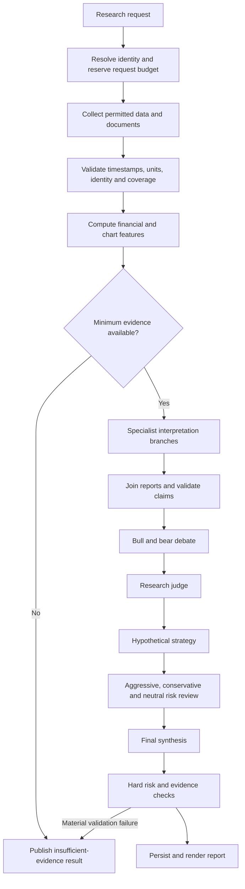

# Agent system and LangGraph workflow

This is the proposed aTrader graph. It retains the analyst/debate/manager structure observed in [TradingAgents graph setup](https://github.com/TauricResearch/TradingAgents/blob/main/tradingagents/graph/setup.py), while defining our own evidence contracts and India-specific responsibilities.

## Principle: roles are not necessarily separate model calls

Fetching prices, computing RSI, checking citations, enforcing limits, and rendering a report should be code, not conversational agents. Specialist interpretation and deliberation use LLMs. Compact mode combines compatible interpretation roles; full mode separates them. Both use the same validated data.

## Role catalogue

| Role | Inputs and tools | Required output | Mode/behavior |
| --- | --- | --- | --- |
| Research coordinator | Identity, horizon, coverage manifest, remaining quota | Frozen run plan and enabled roles | Deterministic P0 routing; no planning-model call |
| Data steward | Source responses, timestamps, units, corporate actions | Validated evidence pack and missingness map | Code; rejects identity/time/unit errors |
| Company analyst | Statements, segments, filings, ownership | Business quality, financial trends, supported risks, claim references | Separate full-mode call |
| Orders and governance analyst | Award disclosures, backlog tables, pledges, auditor/management disclosures | Contract status, concentration, governance concerns, unknowns | Separate full-mode call; combined with company in compact |
| News and catalyst analyst | Deduplicated company/sector documents | Event timeline, novelty, materiality, opposing accounts | Separate full-mode call |
| Macro and geopolitics analyst | Macro releases, global events, company exposures | Scenarios with mechanism, horizon, confirmation triggers | Separate full-mode call; combined with news in compact |
| Community analyst | Permitted posts/comments and sampling metadata | Themes, attention, sentiment, manipulation concerns, coverage | Conditional full-mode call; skipped without valid data |
| Technical analyst | Code-computed features, bar quality, pattern detections | Trend/regime explanation and conditional setups | Separate full-mode call; combined interpretation in compact |
| Bull researcher | Shared analyst packets and valid evidence | Strongest supported thesis; assumptions; falsifiers | One compact call; two turns in full mode |
| Bear researcher | Same evidence and bull case where applicable | Counter-thesis; downside mechanisms; challenges | One compact call; two turns in full mode |
| Research judge | Claims, counterclaims, factual conflicts | Resolved/unresolved issues and research assessment | Full-mode call; included in compact final synthesis |
| Strategy planner (upstream trader equivalent) | Judge result, chart/risk facts, selected horizon | Hypothetical conditions, invalidation, scenario outcomes | Full-mode call; never receives execution tools |
| Aggressive risk reviewer | Strategy, upside/opportunity-cost scenarios | Best defensible risk-taking case and constraints | Full-mode call |
| Conservative risk reviewer | Strategy, failure/capital-loss scenarios | Downside, liquidity, concentration, data-gap objections | Full-mode call |
| Neutral risk reviewer | Both risk reviews and shared facts | Tradeoff assessment without forced compromise | Full-mode call |
| Portfolio manager / final synthesizer | Strategy, risk reviews, optional local portfolio constraints | Final stance, unresolved issues, conditions, evidence quality | One call in either mode |
| Evidence verifier | Structured claims, metric inputs, source spans | Validation failures and publication eligibility | Deterministic first; semantic review folded into judge/final |
| Outcome evaluator | Frozen report and later eligible outcomes | Measured outcome, error classification, candidate lesson | P1; code first, optional separately budgeted reflection |

All LLM roles may abstain. “No applicable backlog”, “social source unavailable”, and “chart history too short” are valid outputs.

## Workflow

Compact mode collapses the judge, strategy, and risk interpretation into final synthesis. The hard evidence and risk checks always remain independent code.

## Debate protocol

1. Both sides receive the same frozen evidence manifest and horizon. No side gets privileged access to a favorable subset.
2. Full mode uses bull opening → bear opening → bull rebuttal → bear rebuttal. Compact uses one turn per side. Stop on the exact turn cap.
3. Each argument supplies `claim_ids`, assumptions, cited support, counter-evidence, and an observable falsifier.
4. A rebuttal identifies the claim it disputes and whether the dispute concerns a fact, assumption, mechanism, or valuation.
5. Debaters cannot invent sources or silently research outside the frozen pack. A missing fact becomes an unresolved question; another run may fetch it.
6. The judge assesses factual support and decision relevance, not eloquence or number of agreeing agents.
7. Risk reviewers challenge the strategy sequentially once each. The final manager may select a cautious or uncertain outcome.
8. Deterministic risk vetoes run after synthesis. An unsupported valuation, unresolved identity conflict, or invalid price basis cannot be repaired by persuasive prose.

An LLM cannot reliably certify another LLM's accuracy. Claim-ID validation only establishes traceability; semantic faithfulness needs labeled evaluations and human audit samples.

## State and execution rules

The shared state contains `run_id`, identity, horizon, `knowledge_cutoff`, input manifest IDs, enabled roles, analyst reports, claim map, debate records, risk flags, final result, budget ledger, and errors. Put document bodies in storage and pass bounded excerpts by reference.

Each specialist owns a separate output key or returns an immutable report object. Use explicit reducers for append-only events, rather than having concurrent nodes overwrite a common message list. The join waits for required branches and records a terminal success/skip/failure state for every optional branch.

Persist checkpoints under a run UUID. Graph state and long-term research memory are separate concerns, following [LangGraph's persistence distinction](https://docs.langchain.com/oss/python/langgraph/persistence). Resume must use the original frozen inputs and configuration. A new cutoff, prompt, model selection, or source manifest creates a new run.

## Default limits and failure behavior

- One active research run initially; up to two concurrent model requests, subject to provider pacing.
- No LLM-driven tool loops in P0: collection and retrieval happen before interpretation.
- Up to 2,000 output tokens per interpretation call as an initial tuning choice; smaller role-specific limits when measured.
- One transient retry per node and one schema repair at most, both charged against the shared hard attempt cap.
- A ten-minute run deadline is a proposed initial setting; quota pauses persist state instead of waiting inside an API request.
- Cancellation prevents new calls and discards incomplete outputs; an already-dispatched provider call may still complete and consume quota.
- Optional-source failure gives a partial report. Missing identity or unusable core inputs gives insufficient evidence.

Request-count arithmetic, including the exact compact/full plans, is defined in [08](08-free-operation-and-openrouter.md).
