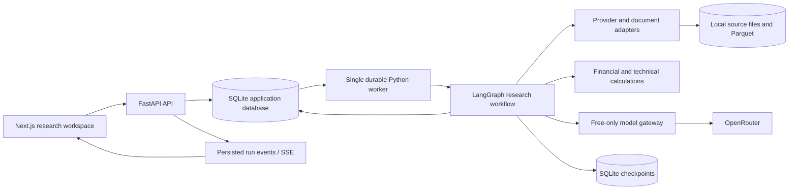

# Technical architecture

Proposed stack: **Python + LangGraph + FastAPI**, **Next.js + TypeScript**, **OpenRouter**, and local storage. This is an implementation blueprint; no services have been installed or started.

## Architecture



## Component choices

| Concern | Initial choice | Why; upgrade condition |
| --- | --- | --- |
| Backend | FastAPI, Pydantic, Python 3.12 candidate | Typed request/output validation; pin tested compatible package versions at build time |
| Orchestration | LangGraph library | Explicit state, joins, conditional edges, and recoverable research stages |
| LLM client | One backend OpenRouter adapter over HTTP | Centralized pricing, capability, quota, timeout, and logging controls |
| Application data | SQLite + SQLAlchemy + migrations | Simple local installation; PostgreSQL when multi-user/concurrent workloads justify it |
| Graph recovery | Persistent SQLite checkpointer | Separate from report archive; PostgreSQL checkpointer on server upgrade |
| Time series | Parquet files; DuckDB for local analytical queries | Efficient historical slices without a separate analytical service |
| Documents | Files by content hash, text/page spans in database | Stable citations and reproducible extraction |
| Retrieval | SQLite full-text search + company/date filters | No embedding API bill; add local embeddings only if measured retrieval gains justify them |
| Calculations | pandas/NumPy and small versioned metric functions | Inspectable arithmetic and indicator definitions |
| PDF parsing | pypdf/pdfplumber candidates; optional local OCR | No paid document service; scanned tables get review flags |
| Frontend | Next.js App Router, TypeScript, Tailwind, accessible primitives | Research pages and interactive evidence views; no required hosted service |
| Charts | TradingView Lightweight Charts | Candlestick/volume rendering; honor license/attribution; supply our own permitted data |
| Async work | SQLite jobs table + one worker process | Durable local queue without Redis; replace when scale requires it |
| Updates | Server-sent events with persisted sequence numbers | Progress is primarily server-to-client; polling fallback |
| Tests | pytest, HTTP contract tests, selected browser flows | Concentrate on financial semantics, isolation, recovery, and user journeys |
| Packaging | Native local processes first; optional containers | Avoid mandatory cloud hosting and unnecessary Windows container setup |

The [Next.js App Router documentation](https://nextjs.org/docs/app), [FastAPI background-task guidance](https://fastapi.tiangolo.com/tutorial/background-tasks/), and [LangGraph persistence guide](https://docs.langchain.com/oss/python/langgraph/persistence) support the framework choices. The durable jobs implementation above is our design; FastAPI response-background tasks alone are not the persistence mechanism.

[Lightweight Charts](https://tradingview.github.io/lightweight-charts/) provides a renderer, not a market-data entitlement. Check its exact [license](https://github.com/tradingview/lightweight-charts/blob/master/LICENSE) and notice/attribution requirements when pinning the dependency.

## Repository layout to create during implementation

```text
apps/
  web/                         Next.js App Router frontend (TypeScript, Tailwind, Lightweight Charts)
    src/
      app/                     Pages (research runs, stock workspace, watchlists, settings)
      components/              UI components, chart canvas, thesis debater view, evidence drawer
      lib/                     API client, SSE streaming hooks, state stores
      types/                   TypeScript contract interfaces

src/
  aTrader/                     Core Python application package (single unified package, src layout)
    api/                       FastAPI application layer
      v1/                      Versioned HTTP endpoints matching /v1/* contract routes
        endpoints/             research_runs, reports, instruments, watchlists, etc.
        router.py              Central v1 APIRouter aggregator
      deps.py                  Shared dependencies (DB session, security/tokens, rate limiting)
      server.py                FastAPI app factory, CORS, exception handlers, SSE mounting
    agents/                    LangGraph multi-agent research workflow
      nodes/                   Analyst nodes (fundamentals, market, technical, bull/bear, risk)
      state.py                 Typed research state & run context schemas
      graph.py                 Graph assembly, conditional routing, checkpoints & resume
      prompts/                 Versioned prompt templates for agents
    data/                      Market data adapters, document parsers, and local storage
      adapters/                BSE/NSE price providers, filings, news & corporate actions
      parsers/                 PDF extraction (pypdf/pdfplumber), HTML disclosure parsers
      storage/                 Time series (Parquet/DuckDB), raw documents & blob cache
    analytics/                 Financial metrics, technical indicators & risk rules
      metrics/                 Fundamental ratios, financial statement arithmetic, backlog
      indicators/              Inspectable technical calculations (RSI, moving averages)
      risk/                    Position sizing limits, exposure calculations, liquidity checks
    worker/                    Durable asynchronous background execution
      runner.py                Transactional SQLite lease claimer, heartbeat & crash recovery loop
      tasks.py                 Research run workflow execution & scheduled maintenance
    core/                      Foundation utilities & shared infrastructure
      config.py                Application settings, directories, environment variables
      llm.py                   OpenRouter client, free-model routing, token/request budgeting
      db.py                    SQLite database engine, session factory, migrations
      schemas.py               Core domain records (Pydantic models for claims, evidence, facts)

tests/
  fixtures/                    Synthetic / permitted versioned test inputs & sample filings
  unit/                        Fast unit tests (agents, financial formulas, indicator logic, parsers)
  integration/                 End-to-end tests (FastAPI /v1 routes, worker leases, LangGraph checkpoints)
  evaluation/                  Golden research evaluation sets and thesis benchmark comparisons

docs/                          Planning and architecture specifications pack
```

### Layout design decisions

- **Unified Python package without `packages/` fragmentation:** Eliminates the overhead of managing multiple sub-packages (`packages/research`, `packages/data`, etc.), distinct `pyproject.toml` files, and complex editable-install linking. All backend domains live under `src/aTrader/` with clean imports (`from aTrader.agents import ...`, `from aTrader.data import ...`).
- **Explicit `api/v1` route mapping:** Directly mirrors the `/v1/...` REST API contracts defined in [07 — Data and API contracts](07-data-and-api-contracts.md), isolating versioned endpoints under `src/aTrader/api/v1/` for straightforward maintenance and future versioning.
- **Dedicated `agents/` domain:** Isolates LangGraph state machines, analyst nodes, and prompt engineering from deterministic financial arithmetic (`analytics/`) and provider ingestion (`data/`).
- **Frontend boundary (`apps/web/`):** Keeps the Next.js application self-contained with its own tooling and dependencies, consuming typed API contracts from the backend.

Runtime databases, checkpoints, provider caches, and secrets should live **outside the OneDrive-synced repository**, in a configurable local application-data directory. Syncing a live SQLite database is not the backup strategy. Export backups from consistent database snapshots.

## Worker and recovery semantics

`POST /research-runs` validates the request, reserves quota, and commits a queued job before returning a run ID. A worker claims a lease transactionally, records a heartbeat, and advances checkpointed graph stages. Expired leases may be reclaimed after crash recovery.

Each stage uses a logical execution key derived from run, node, input manifest, prompt version, and model configuration. Cache successful validated outputs by that key. Persist model attempts separately, including attempts with unknown outcomes after a timeout.

Exactly-once network execution cannot be guaranteed across a crash after the provider responds but before local persistence. Budget conservatively for such attempts, record ambiguity, and avoid claiming perfect deduplication. Completed locally persisted stages must not be called again on normal resume.

Report publication is atomic: save a validated report version and mark its run complete in one application transaction. On invalid output, publish a structured partial/insufficient-evidence record instead of a misleading complete report.

## Data boundaries and security

- OpenRouter and broker credentials stay on the backend; never put them in frontend environment bundles, prompts, exports, or logs.
- Bind the personal app to loopback by default. Require an installation token/session, validate Origin/Host, and restrict CORS. Public access requires proper authentication and authorization.
- All retrieved text is untrusted content. It cannot change instructions, request secrets, invoke arbitrary shell tools, or authorize new URLs.
- Download only through controlled adapters. Block private/loopback destinations, recheck redirects and DNS, restrict file size/type, and apply timeouts to prevent SSRF and resource exhaustion.
- Extract uploads in a constrained process; reject executable content, oversized archives, and unsafe embedded references.
- Sanitize report Markdown/HTML and citations before browser rendering. Link schemes are allowlisted.
- Do not send private holdings or personal identifiers to a free model by default. Compute portfolio limits locally and pass only necessary aggregate constraints when enabled.
- A source's permitted use determines raw-body retention. Source metadata and validation outcomes may survive even when a document must be deleted; related reports must reflect revoked evidence.

## Operational targets

Initial capacity target: one active run, two model requests in flight, ten pilot companies, and a modest local evidence archive. API acknowledgement should be quick because it queues work; model completion time is provider-dependent and should be measured, not promised.

Track requests, tokens, observed cost, latency, source health, parsing failures, invalid claims, retries, checkpoint age, and missing data. Store local structured logs with redacted secrets. A paid tracing platform is not required.

Keep one deployment and one database until an actual bottleneck appears. Kubernetes, distributed vector databases, multiple agent frameworks, and microservices per agent would add complexity without solving the initial research problem.
